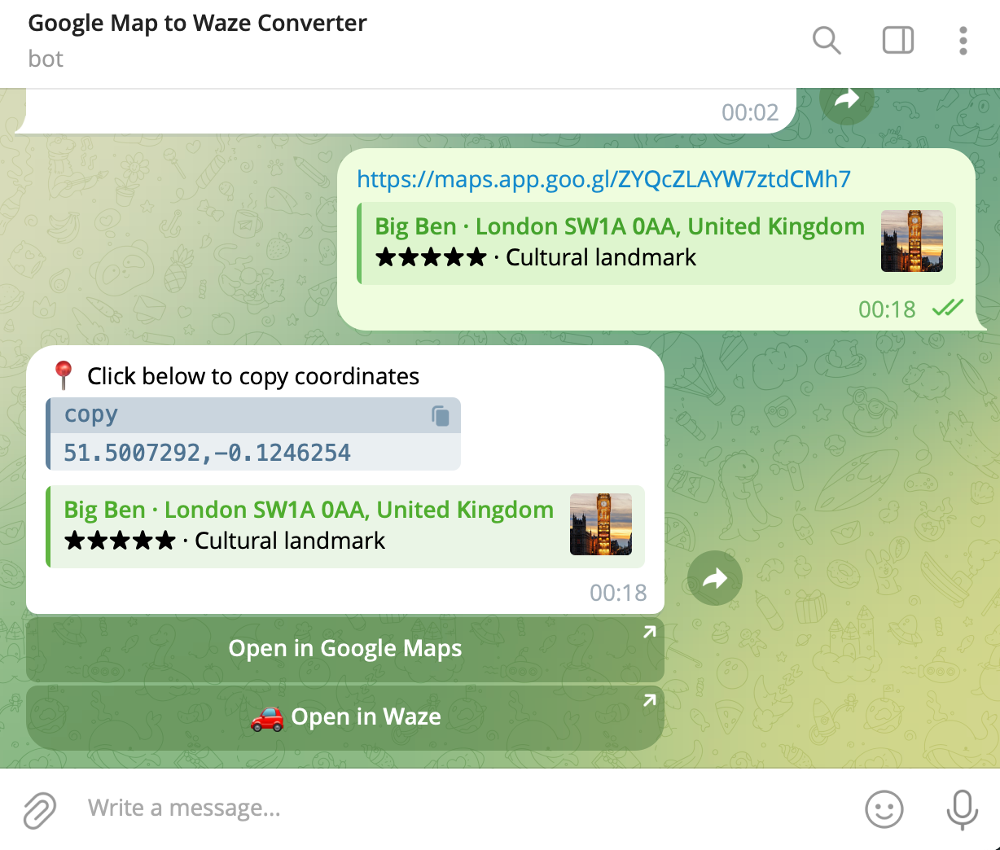

# Google Maps to Waze Converter

Instantly convert Google Maps links to Waze navigation links with one tap!

## About

Google Maps to Waze Converter is a mini app that transforms any Google Maps location into a Waze-ready navigation link in seconds. Perfect for quick route planning and seamless navigation.

## How to Use

1. **Send Maps Link** - Send any Google Maps link (short or full URL)
2. **Get Coordinates** - Get instant response with coordinates
3. **Navigate** - Tap "Open in Waze" to navigate

## Features

- **Extracts exact location coordinates** - Accurately parses Google Maps URLs to extract precise GPS coordinates
- **Works with all Google Maps link formats** - Supports both shortened (goo.gl/maps) and full Google Maps URLs
- **Direct Waze navigation link** - One-tap access to start navigation in the Waze app

## Get Started

Visit our website: [https://gmap2waze.gbitcode.com/](https://gmap2waze.gbitcode.com/)

Use the Telegram Bot: [https://t.me/gMapsToWazeBot](https://t.me/gMapsToWazeBot)

## Need Help?

Having issues or questions? Report bugs, request features, or ask questions on our [GitHub issue tracker](https://github.com/gbitcode/gmap2waze-web/issues).

---

**Just send a Maps link and drive!**
